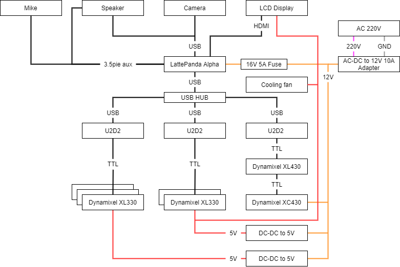
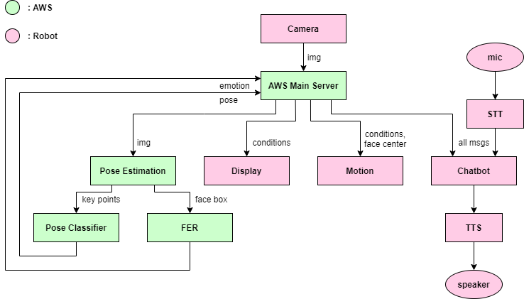

# AI Robot Mate for Individual
<div align=center>

</div>


*YouTube Link :* [](https://www.youtube.com/watch?v=1IyeR2p0NHo)

## Abstract

### 1인가구를 위한 소셜로봇

사용자의 자세, 표정을 인식한 후 이를 기반으로 대화 유도

### Environment / Dependencies
##### Robot
- LattePanda
- Windows
- Python 3.6

##### AWS
- AWS EC2
- Ubuntu 18.04
- CUDA 11.1
- cuDNN 8.0.5
- TensorFlow 2.4

```bash
$ pip3 install -r requirments.txt
```
```bash
$ conda install swig
$ cd tf_pose/pafprocess
$ swig -python -c++ pafprocess.i
$ python3 setup.py build_ext --inplace
```

#### AWS CUDA 버전 설정
```bash
$ sudo rm /usr/local/cuda
$ sudo ln -s /usr/local/cuda-11.1 /usr/local/cuda
```
## Hardware
<div align=center>

</div>

## Software
<div align=center>

</div>


---
## TODO
- [x] ~~Pose Data 수집 : Input data shape (18,2) -> (1,36)~~
- [x] ~~Pose Classifier 모델 수정~~
- [x] ~~Face Expression Recognition 모델 추가~~
- [x] ~~Face Expression Data 수집 -> 드라마, 영화 감정연기 캡쳐~~
- [x] ~~네트워크 구조 변경 : AWS-> main server~~
- [x] ~~aws IP 파일 분리~~
- [x] ~~Face Expression Recognition 모델 학습~~
- [x] ~~Camera Calibration -> 다시 확인~~
- [x] ~~Robot UI Code 통신 연결~~
- [x] ~~Motor Motion Code 통신 연결~~
- [x] ~~Chatbot, TTS 통신 연결~~
- [x] ~~TTS Custom data 생성~~
- [x] ~~TTS Custom data 학습~~
- [x] ~~AWS 환경 설정, 업로드~~